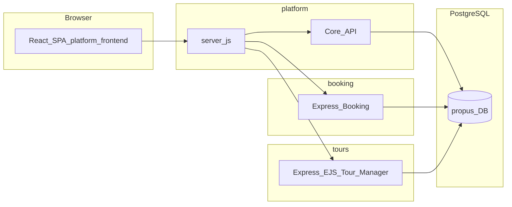

# Propus Platform – Kurzüberblick und Textpflege

Dieses Dokument fasst die **technische Gliederung** der Plattform zusammen und zeigt, **wo deutschsprachige Texte** gepflegt werden. Es ergänzt die Einstiegsdoku im [README.md](../README.md).

## Architektur (übergeordnet)

- **`platform/server.js`**: zentraler HTTP-Einstieg; bündelt Core-Routen, Buchungs-App und Tour-Manager (typisch unter `/tour-manager`).
- **`booking/`**: Haupt-API und Geschäftslogik des Buchungstools (Express).
- **`tours/`**: Tour Manager (Express mit EJS-Templates).
- **`core/`**: gemeinsame SQL-Migrationen, Migration Runner und geteilte Bibliotheken (`core/lib/customer-lookup.js` u. a.). `booking/Dockerfile` kopiert `core/` mit, da `booking/db.js` die zentrale Kundensuche aus `core/lib/` importiert (Build-Context ist deshalb Repo-Root).
- **`auth/`**: Auth-Hilfsfunktionen und Sitzungsverwaltung.

Datenbank **eine Instanz**, logisch getrennte Schemas (u. a. `core`, `booking`, `tour_manager`); Module setzen `search_path` passend.

## Wo Texte liegen (Priorität für Deutsch)

| Priorität | Bereich | Pfad(e) |
|-----------|---------|---------|
| 1 | Repo-Einstieg, Setup, Architektur | [README.md](../README.md) |
| 2 | Admin- und Portal-UI (Übersetzungs-Keys) | [app/src/i18n/de.json](../app/src/i18n/de.json) |
| 3 | In-App-Changelog / Release-Notizen | [app/src/data/changelogData.ts](../app/src/data/changelogData.ts) |
| 4 | Statische Shell (Seitentitel etc.) | [app/src/app/layout.tsx](../app/src/app/layout.tsx) |
| 5 | Sichtbare Build-Version | `app/public/VERSION` |
| 6 | E-Mails und ähnliche Vorlagen | `booking/templates/` (u. a. E-Mail-Texte) |

**Hinweis:** UI-Texte werden über **Keys** in `de.json` (und weiteren Sprachen) geladen; nur die **Werte** übersetzen, Keys und Platzhalter wie `{{name}}` unverändert lassen.

## Routen-Landkarte (Frontend)

Die sichtbaren Bereiche der React-App sind in [app/src/components/ClientShell.tsx](../app/src/components/ClientShell.tsx) an den Routen erkennbar (Dashboard, Bestellungen, Kunden, Einstellungen, Buchungs-Wizard, Portal usw.). Änderungen an Menü- oder Seitentiteln hängen typischerweise an denselben i18n-Keys wie die Navigation.

**Wichtige Routen-Änderungen (April 2026):**

| Route | Vorher | Jetzt |
|---|---|---|
| `/settings/companies` | `CompanyManagementPage` (Firmenverwaltung) | Redirect → `/customers` |

Portal-Rollen werden nicht mehr in einer separaten Firmenverwaltung gesetzt, sondern direkt am Kontakt im Kundenstamm (`/customers`). Siehe [ROLES_PERMISSIONS.md §7.0](./ROLES_PERMISSIONS.md).

## Pflegeempfehlung

1. Fachliche Begriffe (EXXAS, Produktnamen) **einheitlich** schreiben.
2. **Du/Sie**: Im internen Admin ist „du“ bei Einstellungstexten üblich; kundenorientierte Fließtexte oft „Sie“ – bei großen Umbauten Stil vereinheitlichen.
3. Nach inhaltlichen Änderungen kurz prüfen, ob **Changelog** und ggf. **README** mitgezogen werden sollen.
