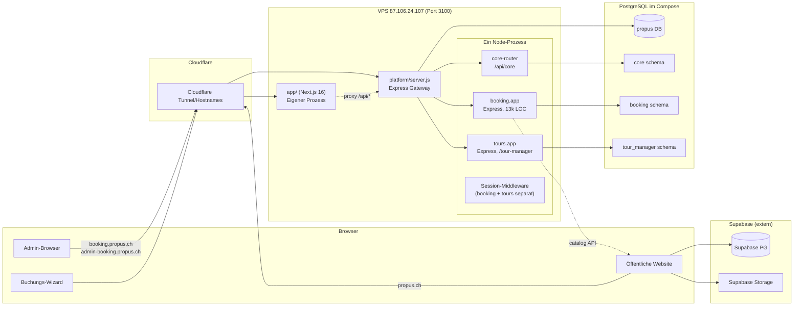
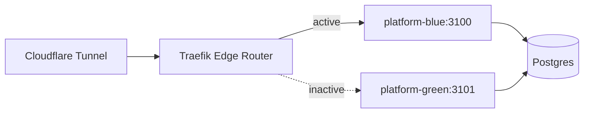

# Phase 4 — Architektur- & Workflow-Review

**Ziel:** Über Einzelbugs hinausblicken — Wo will die Plattform in 12 Monaten hin, und was bremst heute?

---

## 1. Ist-Architektur (Stand Audit)



**Kern-Befund:** `platform/server.js` ist kein echter Gateway — es mountet zwei Express-Apps (`booking.app`, `tours.app`) in denselben Node-Prozess. Damit ist „ein Port = ein Service“ zwar erfüllt, aber die Illusion der Trennung bricht, sobald man genauer hinsieht:
- Gemeinsamer Event-Loop → eine blockierende Operation in booking stallt auch tours.
- Zwei Express-Apps, zwei Session-Middlewares (mit unterschiedlichen Secrets/TTLs), ein Rewrite von booking-Admin-Session in tours-Session (`bridgeBookingAdminSession`) — **hybrides** Auth-Modell.
- Keine unabhängige Skalierung (z. B. tour-Cron-Last kann man nicht auf einen zweiten Container isolieren).

---

## 2. Monorepo-Struktur

**Aktueller Zustand:** Sieben `package.json` im Repo-Root ohne Workspace-Definition. Jeder Ordner ist ein eigenständiges npm-Paket mit separater `node_modules`. Dependency-Updates (z. B. nodemailer CVE, siehe 10-STATIC-ANALYSIS) müssen 3× gemacht werden.

**Empfehlung:** `pnpm` Workspaces mit Hoisting + `turbo` für CI-Pipelines.

Vorteile:
- `nodemailer` einmal installiert, einmal upgedatet.
- Shared-Module (z. B. `@propus/mail`, `@propus/rbac`, `@propus/pg-session`) ohne sym-link-Trickserei.
- `turbo run build --filter=...^^` für selektive CI-Builds (nur betroffene Module).
- Lockfile: eine Datei (`pnpm-lock.yaml`) statt sechs.

**Konkrete Aufteilung:**

```
packages/
  app/            # Next.js 16, wie heute
  platform/       # Gateway, schmal
  booking/        # Domain: Buchungen
  tours/          # Domain: Touren
  website/        # Astro
shared/
  db/             # pg-Pool, search_path-Helper, Session-Store
  mail/           # nodemailer-Wrapper mit Redaktion
  rbac/           # access-rbac.js zentralisiert
  types/          # Shared TypeScript Types (booking↔app)
  validation/     # Zod-Schemas für API-Payloads
```

Migrations-Pfad: Gradually, beginnend mit `shared/db`, weil das den breitesten Zugriff hat. Danach `shared/mail` (löst gleich das nodemailer-CVE-Dreifach-Update).

**Code-Duplikation zwischen booking/ und tours/ (identifiziert):**
- Session-Handling (`bridgeBookingAdminSession` ist eigener Brückenbauer)
- Mail-Template-Rendering
- Calendar/ICS-Generierung (nur booking nutzt MS Graph, tours hat parallelen Code)
- RBAC-Permission-Auflösung (booking hat `access-rbac.js`, tours hat Inline-Checks)
- SwissQRBill-Integration (beide Module haben swissqrbill als Dep)
- Nodemailer-Wrapper

Schätzung: ~4–6 kLOC identisch oder nah-identisch in beiden Modulen.

---

## 3. Auth-Konsolidierung

**Heutige Lage:** Drei Wahrheiten.

| Schicht | Mechanismus | Wo |
|---|---|---|
| 1 | Logto OIDC (Magic-Link, Passwort-Reset) | `auth/logto-config.js`, `booking/` Endpunkte |
| 2 | Lokale Session (`admin_session`-Cookie + PG-Session-Store) | `booking/server.js`, eigene Admin-User-Tabelle |
| 3 | Tours-Session (eigener Store, eigenes Secret) | `platform/server.js:55-73` mit Bridge zu Booking |
| 4 (Website) | Supabase Auth | `website/` |

**Probleme:**
- `bridgeBookingAdminSession` (`platform/server.js:92`) schreibt Booking-Session-Daten in die Tours-Session um. Das ist ein hand-gebastelter SSO.
- Vier Cookies, vier TTLs, vier Reset-Pfade.
- Migrationen `022_customers_keycloak_sub`, `033_remove_logto_cutover`, `061_admin_users_logto_fields`, `008_rename_keycloak_cols_to_auth` deuten auf mehrere Migration-Wellen (Keycloak → Logto → lokal?).

**Zielzustand:** Eine OIDC-Wahrheit (Logto mit Sub-Tenant für Admin + Portal + Customer), ausgelöst auf allen Frontends:
- Admin-SPA / Next: Logto Session via `openid-client`
- Booking-/Tours-Express: JWT-Validation als Middleware (Logto-issued), keine lokalen Sessions mehr
- Website: Logto ersetzt Supabase-Auth (Supabase nur noch Datenhaltung)

**Aufwand:** L — ein ganzes Quartal, inkl. Customer-Portal-Migration.

**Zwischenlösung bis dahin:** Wenigstens das Session-Secret-Handling (BUG-08, BUG-09, BUG-19) sofort fixen.

---

## 4. API-Gateway vs BFF

**Heutige Architektur:** `platform/server.js` ist ein „Mount-Aggregator“ — kein echtes Gateway (kein Rate-Limiting auf Edge, keine Auth-Normalisierung, kein Request-Logging zentral, kein Response-Transformation).

**Option A — Platform/Express als echter Gateway härten:**
- Zentrale Request-ID, Pino-Logging pro Request (pino-http ist schon da)
- Zentraler Rate-Limiter vor beiden Sub-Apps
- Zentrale CORS-Policy
- Header-Sanitization (BUG-17)

**Option B — Next.js-App als BFF, Express als pure Daten-Backend:**
- Alle `/api/*`-Calls gehen an Next
- Next übernimmt Auth, Rate-Limit, Caching
- Express-Services nur im internen Netzwerk erreichbar

**Meine Empfehlung:** Option A kurzfristig (1 Woche Aufwand), Option B mittelfristig mit Frontend-Konsolidierung. Solange das Admin-Frontend eine SPA-unter-Next bleibt, bringt ein BFF-Ansatz wenig Mehrwert.

---

## 5. Datenmodell & `core`-Schema-Rolle

**Aktueller Zustand:** `core` enthält gemeinsame Entities (customers, contacts, companies, sessions, api_keys, tickets). `booking.orders` und `tour_manager.tours` FK'en auf `core.customers`. Gut.

**Wo `core` mehr aufnehmen sollte:**
- **`core.addresses`** — Adressen tauchen heute in `booking.orders`, `tour_manager.subscriptions`, `core.customers` in Varianten auf. Normalisierung wäre ein großer Schritt (viele Migrationen 016, 017, 019, 045 drehen sich um Contact/Address-Dedupe).
- **`core.photographers`** — aktuell in `booking` (drei Migrationen: 009, 010, 011), obwohl sie auch im Tour-Manager-Kontext relevant werden (Tour-Fotograf).
- **`core.products`** / **`core.services`** — Mehrfach-Definition in booking + tour_manager ist offensichtlich aus Migrationen 025, 027, 042, 043 erkennbar.
- **`core.invoices`** — Migration 026 hat bereits eine `invoices_central_view` angelegt, aber nicht als Quelle-der-Wahrheit. Auf Dauer ein zentrale Rechnungstabelle, die booking/tours/exxas vereint.

**Aufwand:** Iterativ über mehrere Quartale. Jede Tabellen-Extraktion ist eine eigene Migration mit Code-Anpassung in beiden Modulen.

---

## 6. Frontend-Konsolidierung

**Heutige Lage:** Zwei Admin-Frontends im Repo:

| Technologie | Standort | Status |
|---|---|---|
| Next.js 16 App | `app/` | „Primäres Admin-Frontend" laut README |
| Vite/React-SPA | `platform/frontend/` laut README | *existiert im Repo nicht — mutmaßlich gelöscht/migriert* |
| Legacy-SPA im Next | `app/src/pages-legacy/` | Hauptteil der Seiten |

**Migrationspfad zur Single-App:**

1. **Jetzt:** `"use client"`-Direktiven in allen interaktiven Komponenten setzen (BUG-18) — macht die Verschiebung einzelner Seiten überhaupt erst möglich.
2. **Quartal 1:** Hochfrequente Seiten (Dashboard, OrdersPage, CustomersPage) aus `pages-legacy/` in `app/(admin)/*/page.tsx` migrieren. Pro Seite: SSR mit Server Components für Initial-Load, Client-Inseln für Interaktion.
3. **Quartal 2:** Booking-Wizard (`BookingWizardPage.tsx`) als Server-Component mit schrittweiser Form-Island. Wichtig für SEO/Geschwindigkeit, weil das der öffentliche Flow ist.
4. **Quartal 3:** Restliche Legacy-Pages. `ClientShellLoader` und `[[...slug]]/page.tsx` entfernen, sobald keine Seite mehr dort landet.

**Alternative:** Aus pragmatischen Gründen SPA-in-Next belassen, dafür `app/` komplett in eine reine Vite-React-App umbauen und Next zurückbauen auf BFF. Das ist weniger ambitioniert, aber ehrlicher zur heutigen Realität.

Ich empfehle ersteres: Der strategische Wert von Next's SSR + Streaming ist für ein B2B-Admin begrenzt, aber für den Kunden-Buchungs-Wizard und die Gallery-Public-Pages sehr groß.

---

## 7. Observability

**Vorhanden:**
- `winston` in booking (nur teilweise genutzt, Mischung mit `console.log` — BUG-36)
- `pino` + `pino-http` + `pino-roll` in platform (modern, strukturiert)
- `tour_manager.employee_activity_log`, `booking.auth_audit_log`, `booking.order_status_audit` (DB-Audit, vorbildlich)
- Health-Endpoint `/api/core/health`

**Fehlt:**
- **Error-Tracking:** kein Sentry/Rollbar/Bugsnag. Fehler bleiben in Container-Logs.
- **Metrics:** kein Prometheus-/OpenTelemetry-Export. Keine Dashboards für Request-Rate, DB-Pool-Auslastung, Mail-Queue-Länge.
- **Uptime-Monitoring:** Cloudflare-Health-Checks sind plausibel, aber nicht im Repo dokumentiert. Kein Status-Page-Setup.
- **Frontend-Error-Tracking:** React-Errors (ErrorBoundaries fehlen großteils, sichtbar in ESLint-Output) werden nicht gesammelt.

**Empfehlung:**
1. **Sentry**-Integration (Next + Express) — kostenlos bis 5 k Events/Monat, installiert in ~1 h.
2. **pino** zentral auf strukturiertes JSON → Loki/Grafana Cloud (gratis bis 50 GB/Monat).
3. **Prometheus-Metrics** via `prom-client` in Express + `/metrics`-Endpoint (geschützt), OpenTelemetry-Spans für MS-Graph/Payrexx-Calls.

**Aufwand:** M — 1 Sprint für komplettes Setup.

---

## 8. Testing-Backlog

| Modul | Test-Files | Geschätzte Coverage |
|---|---|---|
| booking | 4 (`tests/*.test.js`) | <10 % — nur reine Logik (pricing, state-machine, rbac, order-storage) |
| tours | 9 (`test/*.test.js`) | ~25 % — besser, aber Auth/Routes untested |
| app | vorhanden (vitest + Playwright), nicht ausgeführt | unbekannt |
| platform | 0 | 0 % |
| website | 0 | 0 % |
| core | 0 | 0 % |
| auth | 0 | 0 % |

**Kritische Pfade ohne Tests (Test-Backlog-Kandidaten):**

Priorität 1 (sofortige Testabdeckung):
- **Booking-Slot-Allocation** — `slot-generator.js` + `travel.js`, inkl. Same-Day-Routing
- **Double-Booking-Schutz** — Race-Condition-Test mit zwei parallelen Requests
- **Renewal-Invoice-Flow** — End-to-End: Schedule → Invoice-Create → Mail-Send → Payrexx-Webhook → Status=paid
- **Auth-Flow** — Login + Session-Bridge + Logout (alle drei Cookies sauber?)
- **Payrexx-Webhook** — Signature-Check + Replay-Attack + ungültige Payloads

Priorität 2:
- **RBAC per Rolle** — Admin vs Photographer vs Customer für jede Mutation (kann tabellenartig generiert werden)
- **Cron-Job-Idempotenz** — jeder Job mit zwei konsekutiven Läufen auf denselben Daten
- **Mail-Template-Rendering** — alle Templates rendern ohne Fehler mit Minimaldaten

Priorität 3:
- **Bank-Import-Parsing** — CAMT.053 Golden-Files
- **Matterport-Integration** — Mocked Graph-API
- **Admin-UI-Smoke** — Playwright auf Staging

**Empfehlung:** `vitest` als einheitliches Framework auch für booking/tours (statt `node --test`), damit Test-Tooling konsistent ist.

---

## 9. Deploy-Workflow

**Heute:**
- `scripts/deploy-vps.ps1` (PowerShell, lokal + ephemeres Tarball-Upload)
- `.github/workflows/deploy-vps-and-booking-smoke.yml` (automatisch auf Push)
- `scripts/deploy-remote.sh` (Phase 2 auf VPS)
- `scripts/start.sh` (Phase 3 im Container)

**Probleme:**
- Keine Test-Required-Checks (BUG-60)
- Kein Rollback-Skript (per `docker compose` nur manuelles „previous-image“-Restore)
- Single-VPS, kein Blue/Green

**Vorschlag Blue/Green auf selbem VPS mit Traefik:**



Deploy-Sequenz:
1. Pull new image → start `platform-green` auf 3101, nicht im Traefik-Pool
2. Healthcheck + Smoke-Tests gegen `127.0.0.1:3101`
3. Traefik-Label umschalten → Traffic auf green
4. Blue stoppen (keep image als Rollback)
5. Rollback = Traefik-Flip zurück

**Aufwand:** M — ein Sprint für Traefik-Setup + Health-Gates.

**Canary** ist im B2B-Admin-Kontext wahrscheinlich overkill. Blue/Green reicht.

---

## 10. Backup / DR

**Heute:**
- `scripts/backup-vps.sh` referenziert in compose.vps.yml (nicht im Scope gereviewt)
- `docs/BACKUPS.md` existiert
- `BACKUP_VOLUME_PATHS: /data/state:/app/logs:/upload_staging` — Volumes gesichert
- Uploads auf NAS-Mounts (Nextcloud / UGREEN) — deren Backups nicht im Repo-Scope

**Risiken:**
- **Kein dokumentiertes RTO/RPO** (wie schnell bis zum Wiederanlauf? Wie viel Datenverlust max?)
- **Kein regelmäßiger Restore-Test** erkennbar. Backup, das nie wiederhergestellt wurde, ist kein Backup.
- **Backups auf dem VPS selbst?** Falls ja, sind bei Server-Verlust alle Backups weg.

**Empfehlung:**
1. **Off-site-Backup** — tägliches `pg_dump` + Upload nach S3-kompatiblem Storage (Backblaze, Wasabi, Cloudflare R2).
2. **Quarterly Restore-Drill** dokumentiert in `docs/BACKUPS.md`: staging-DB aus Backup restaurieren, Smoke-Tests, Report.
3. **PITR** (Point-in-time Recovery) via WAL-Archivierung — in PG 16 mit `pg_basebackup` + WAL-Shipping relativ einfach.

**Aufwand:** M-L — je nach Storage-Setup.

---

## 11. Datenbank-Schema-Drift

**Problem:** `booking/migrations/` enthält 84 Files mit gemischten Schema- und Data-Fixes. `core/migrations/` ist sauberer. Keine Checksumme im Runner → geänderte Migration wird nicht bemerkt.

**Empfehlungen:**
- Migrations-Tool ersetzen durch `node-pg-migrate`, `sqitch` oder `pgroll` (für Zero-Downtime). Alle drei können Checksummen und definieren klare Up/Down-Pfade.
- Data-Fixes ablösen von Schema-Migrationen (siehe BUG-50).
- Ein einziger Runner, kein getrennter Booking-Runner (widerspricht README, aber ich fand keinen zweiten).

**Aufwand:** L (Tool-Wechsel ist Tagesarbeit + Migration aller bestehenden Files).

---

## 12. Architektur-Scorecard

| Aspekt | Heute | Ziel | Gap |
|---|---|---|---|
| Monorepo-Tooling | 7× npm | pnpm + turbo | M |
| Auth-Wahrheiten | 4 | 1 (Logto) | L |
| API-Gateway | Mount-Aggregator | Echter Gateway oder BFF | M |
| Datenmodell | Duplikate customer/address/products | `core`-First | L |
| Frontend | SPA-in-Next + Legacy | Native Next mit SSR | L |
| Observability | Logs only | Logs + Traces + Metrics + Errors | M |
| Tests | 10 % | 60 % kritische Pfade | M |
| Deploy | Single-VPS, no-rollback | Blue/Green mit Traefik | M |
| Backup | Existiert, unklar | RTO 4h / RPO 1h + Drill | M |
| Migrations | Custom-Runner | Etabliertes Tool mit Checksum | L |

---

## 13. Architektur-Fazit

Die Plattform ist für ein Small-Team/Solo-Projekt überdurchschnittlich strukturiert: klarer Deploy-Flow, Domain-Trennung via PG-Schemas, dokumentierte Prozesse. Das größte strategische Risiko ist **das monolithische `booking/server.js`** (technische Schuld, die jedes Refactoring teurer macht) und **die hybride Auth-Landschaft** (Logto + lokale Sessions + Supabase). Diese beiden Baustellen würde ich als erstes großes Epic angehen, sobald die „Now"-Buckets in `99-ACTION-PLAN.md` abgearbeitet sind.

Die zweite Diagnose: `platform/` löst das „ein Port“-Problem, aber vertieft das „alles im selben Prozess“-Problem. Je länger man das beibehält, desto schmerzhafter wird der Schritt zu Multi-Instance-Deployment.
