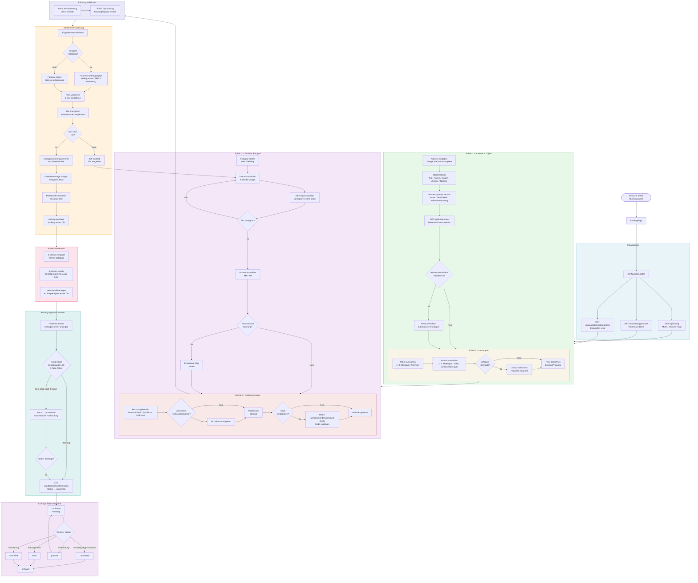

# Buchungsflow – Propus Platform



## Legende

| Symbol | Bedeutung |
|--------|-----------|
| Abgerundetes Rechteck `([...])` | Start / Ende |
| Rechteck `[...]` | Aktion / Schritt |
| Raute `{...}` | Entscheidung |
| Sechseck `{{...}}` | Datenspeicher |

## Status-Übergänge im Überblick

```
pending
  ├─► confirmed   (Kunde bestätigt innerhalb von 3 Tagen)
  └─► provisional (3 Tage ohne Bestätigung → automatisch)
          └─► confirmed (Kunde bestätigt nachträglich)

confirmed
  ├─► paused     (Umbuchung)
  │     └─► confirmed (Umbuchung bestätigt)
  ├─► completed  (Shooting erledigt)
  │     └─► done (Fotos geliefert)
  └─► cancelled  (Stornierung)

alle → archived  (Abschluss / Archivierung)
```

## API-Endpunkte

| Schritt | Methode | Endpunkt | Beschreibung |
|---------|---------|----------|--------------|
| Init | GET | `/api/config` | MwSt., Feature Flags |
| Init | GET | `/api/catalog/products` | Pakete & Addons |
| Init | GET | `/api/catalog/photographers` | Fotografen-Liste |
| Schritt 1 | GET | `/api/travel-zone` | Reisezeit-Zone |
| Schritt 3 | GET | `/api/availability` | Verfügbare Slots |
| Schritt 4 | POST | `/api/admin/orders/discount-check` | Rabattcode prüfen |
| Einreichen | POST | `/api/booking` | Buchung erstellen |
| Bestätigen | GET | `/api/booking/confirm/:token` | Buchung bestätigen |
